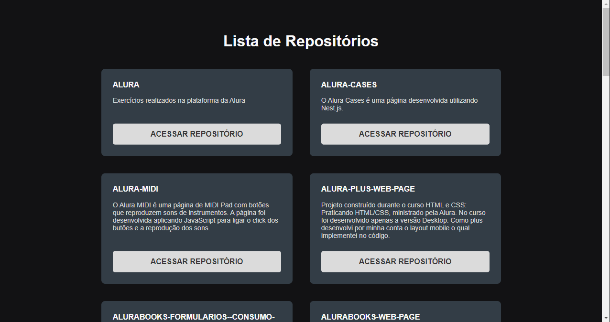

# Lista de Repositórios Page

> Lista de Repositórios Page

Projeto construído durante o Fundamentos do ReactJS, ministrado pela Rocketseat.

<!-- [Clique aqui para acessar]() -->

## Tecnologias

- React.js
- TypeScript
- Babel
- Webpack
- Sass
- E algumas outras

## 💻 Projeto

O página é uma Lista de Repositórios de meu perfil. A página foi desenvolvida usando ReactJS, TypeScript, dentre outras tecnologias. Nesse projeto também foi utilizado a API do GitHub para preencher a lista de repositótios. O objetivo geral do curso foi entender como criar um projeto ReactJS do completo zero e entender o uso de cada dependência instalada.
